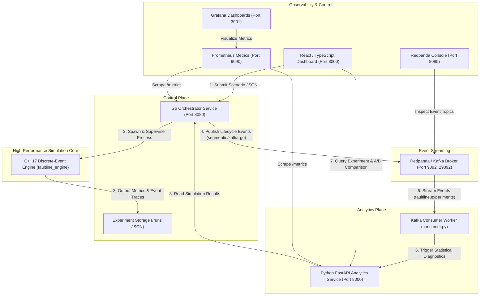

# Faultline

### Deterministic Distributed Systems Failure Simulation Engine

[](https://github.com/rahul-1909/faultline-simulator/actions/workflows/ci.yml)
[](https://faultline-cvza.onrender.com/)
[](https://isocpp.org/)
[](https://golang.org/)
[](https://python.org/)
[](https://react.dev/)
[](LICENSE)

> **Live Deployment**: Access the live interactive web dashboard and simulation engine at [https://faultline-cvza.onrender.com/](https://faultline-cvza.onrender.com/).

---

## 1. Problem Statement

Modern microservice architectures at hyperscalers (such as Netflix, Amazon, Uber, and Google) are subject to complex cascading failure modes:
- **Cascading Failures**: When downstream dependencies degrade, bounded queues saturate and backpressure propagates upstream until edge gateways fail.
- **Retry Storms & Stampedes**: Naive retries amplify traffic on recovering services, turning transient blips into persistent outages.
- **Network Partitions & Link Degradation**: Severed links drop in-flight packets, stranding upstream callers and triggering queue timeouts.
- **Tail Latency Explosions**: Concurrency bottlenecks push p95 and p99 latency past timeout thresholds.

Testing these failure scenarios in physical staging environments or via wall-clock emulation is slow, expensive, and non-deterministic.

**Faultline** is a high-performance, deterministic discrete-event simulation (DES) platform for modeling distributed systems under stress. By maintaining a virtual clock priority queue and seed-controlled pseudo-randomness, Faultline simulates complex multi-hop network topologies, bounded FIFO queues, worker concurrency, and chaos injections in milliseconds—producing 100% reproducible results for resilience benchmarking, bottleneck diagnosis, and A/B mitigation comparison.

---

## 2. Architecture Overview

Faultline supports two execution models:

1. **Unified Cloud Service (Render / Production)**: A multi-stage container that co-locates the C++17 discrete-event simulation engine, the Python FastAPI analytics daemon, and the Go HTTP orchestrator. The Go orchestrator serves the precompiled React 18 frontend at `/`, proxies analytics requests to FastAPI internally, manages simulation subprocesses, and exports Prometheus metrics—all accessible through a single public URL.
2. **Distributed Microservices Stack (Docker Compose)**: Isolates services across individual containers, streaming simulation lifecycle events through a Redpanda (Kafka) broker to an asynchronous Python analytics consumer, with Prometheus and Grafana for time-series observability.

### Distributed Event-Driven Topology



---

## 3. Simulated Microservices Topology

Faultline models a multi-tier microservice architecture handling e-commerce order workflows:

```
[ Edge Clients ]
       |
       v (Link L1: Latency 2ms, Loss 0.0)
+--------------+
|  API Gateway | (Workers: 8, Queue: 100, Base Latency: 5ms)
+------+-------+
       | (Link L2: Latency 4ms, Loss 0.0)
       v
+--------------+
| Order Service| (Workers: 4, Queue: 50, Base Latency: 15ms)
+------+-------+
       | (Link L3: Latency 10ms, Subject to Chaos Partition)
       v
+--------------+
|Payment Service| (Workers: 2, Queue: 20, Base Latency: 45ms)  <-- Common Bottleneck
+------+-------+
       | (Link L4: Latency 3ms, Loss 0.0)
       v
+--------------+
| Inventory Svc| (Workers: 4, Queue: 50, Base Latency: 10ms)
+--------------+
```

### Request Flow & State Transitions:
1. **Edge Dispatch**: Requests arrive according to constant or Poisson distributions.
2. **Worker Scheduling & Queueing**: Arriving requests enter worker slots. If workers are saturated, requests enter a bounded FIFO queue. If the queue is full, the request is dropped immediately (`QUEUE_FULL`).
3. **Multi-Hop Sequential Processing**: A request completes execution at node N before transmitting across network link L to node N+1. Queueing delay, worker service time, and network latency are accumulated into total end-to-end latency.
4. **Terminal States**: Every request reaches an unambiguous terminal state: `SUCCEEDED` only upon completion of the final service hop, or `FAILED` if dropped due to node crash (`NODE_DOWN`), queue saturation (`QUEUE_FULL`), network partition (`NETWORK_PARTITION`), packet loss (`PACKET_LOSS`), or retry exhaustion (`RETRY_EXHAUSTED`).

---

## 4. Discrete-Event Simulation Mechanics

Unlike real-time emulation, Faultline runs on a **Discrete-Event Simulation (DES)** engine:
- **Priority Queue Scheduler**: Events are sorted strictly by `(timestamp, priority, sequence_id)`. Time advances instantaneously to the next scheduled event.
- **Epoch Generation Guarding**: Nodes track a monotonic generation epoch. When a service crashes and restarts, stale worker completion events from prior epochs are invalidated, preventing worker underflow or phantom completions.
- **Deterministic Seeded PRNG**: All jitter, retry delays, and probabilistic network packet losses use a standard 64-bit Mersenne Twister (`std::mt19937_64`) initialized with a user-specified seed. Running the same scenario with the same seed produces identical results down to the microsecond.
- **Route Link Validation**: Every consecutive hop in a workload route is strictly verified against defined network links. Scenarios with missing hops are rejected upfront.

---

## 5. Supported Fault Events Catalog

| Fault Type | Scenario Canonical Name | Scenario Aliases | Description & Engine Behavior |
| :--- | :--- | :--- | :--- |
| **Node Crash** | `NODE_CRASH` | `CRASH_NODE` | Transitions node to `OFFLINE`. Aborts processing workers and flushes queued requests as `NODE_DOWN`. Automatically recovers after `duration_ms`. |
| **Network Partition** | `NETWORK_PARTITION` | `PARTITION_LINK` | Flags network link as severed. In-transit and subsequent packets are dropped as `NETWORK_PARTITION`. Automatically heals after `duration_ms`. |
| **Packet Loss** | Configured via `drop_rate` | `loss_rate` | Probabilistically drops packets crossing the link based on PRNG seeded draw (`PACKET_LOSS`). |
| **Queue Overflow** | Implicit under load | N/A | Saturated FIFO queues reject new arrivals immediately (`QUEUE_FULL`). |
| **Retry Storm** | Workload + Faults | N/A | Retries with exponential backoff and jitter re-inject requests into the gateway upon failure until `max_retries` is reached. |

---

## 6. Metrics & Statistical Methodology

- **Availability Rate (%)**:
  $$\text{Availability} = \left(\frac{\text{Successful Requests}}{\text{Total Injected Requests}}\right) \times 100$$
- **Nearest-Rank Latency Percentiles**:
  Computed using standard nearest-rank indexing:
  $$\text{Index} = \lceil p \times N \rceil - 1$$
  Guaranteeing strict monotonicity ($p_{50} \le p_{95} \le p_{99} \le \text{max}$).
- **System Reliability Index (SRI)**:
  $$\text{SRI} = 0.70 \times \text{Availability} + 0.30 \times \text{Latency Compliance Score}$$
  Where Latency Compliance scores $100$ when $p_{95} \le 50\text{ ms}$, decaying linearly for higher tail latency.
- **Bottleneck Diagnosis**: Ranks nodes by drop count and peak queue saturation to pinpoint the primary failure bottleneck.
- **A/B Comparison Modes**:
  1. `controlled_retry`: Evaluates identical topology and workload varying only the retry policy.
  2. `architecture_comparison`: Evaluates architectural differences (worker concurrency, queue capacity, network topology).
  - **Latency Delta Sign Convention**: Negative delta ($-\Delta$ ms) indicates improved/faster performance; positive delta ($+\Delta$ ms) indicates regression.

---

## 7. Scenario JSON Schema

Scenarios support both canonical keys and backward-compatible aliases:

```json
{
  "name": "Payment Service Cascading Outage",
  "seed": 42,
  "duration_ms": 3000,
  "workload": {
    "requests_per_second": 120.0,
    "duration_ms": 3000,
    "route": [
      "api-gateway",
      "order-service",
      "payment-service",
      "inventory-service"
    ],
    "retry_policy": {
      "max_retries": 3,
      "backoff_ms": 25,
      "backoff_multiplier": 1.5,
      "jitter_ms": 5
    }
  },
  "nodes": [
    {
      "id": "api-gateway",
      "concurrency": 8,
      "service_time_ms": 5,
      "queue_capacity": 100
    },
    {
      "id": "order-service",
      "concurrency": 4,
      "service_time_ms": 15,
      "queue_capacity": 50
    },
    {
      "id": "payment-service",
      "concurrency": 2,
      "service_time_ms": 45,
      "queue_capacity": 20
    },
    {
      "id": "inventory-service",
      "concurrency": 4,
      "service_time_ms": 10,
      "queue_capacity": 50
    }
  ],
  "links": [
    {
      "id": "gw->order",
      "source": "api-gateway",
      "target": "order-service",
      "latency_ms": 2,
      "jitter_ms": 1,
      "drop_rate": 0.0
    },
    {
      "id": "order->payment",
      "source": "order-service",
      "target": "payment-service",
      "latency_ms": 5,
      "jitter_ms": 2,
      "drop_rate": 0.0
    },
    {
      "id": "payment->inventory",
      "source": "payment-service",
      "target": "inventory-service",
      "latency_ms": 3,
      "jitter_ms": 1,
      "drop_rate": 0.0
    }
  ],
  "chaos": [
    {
      "time_ms": 500,
      "duration_ms": 1000,
      "type": "NODE_CRASH",
      "target": "payment-service"
    }
  ]
}
```

### Supported Schema Aliases:
- `workload.requests_per_second` <-> `workload.arrival_rate_rps`
- `nodes[].concurrency` <-> `nodes[].workers`
- `nodes[].service_time_ms` <-> `nodes[].processing_time_ms`
- `links[].drop_rate` <-> `links[].loss_rate`
- `chaos` <-> `events`

---

## 8. Deployment & Quickstart

Faultline provides two deployment options: single-container unified web service and multi-container Docker Compose.

### Option A: Unified Cloud Web Service (Render / Docker)

The unified deployment packages the entire stack (C++ engine, Python FastAPI analytics, Go orchestrator, and React frontend) into a single container. The Go orchestrator serves the React dashboard at `/` and handles all API routes:

- **Live URL**: [https://faultline-cvza.onrender.com/](https://faultline-cvza.onrender.com/)
- **Configuration**: Defined in `render.yaml` and `Dockerfile`.

To build and run the unified container locally:

```bash
docker build -t faultline:latest .
docker run -p 8080:8080 -e PORT=8080 faultline:latest
```

Then open `http://localhost:8080` in your browser.

### Option B: Distributed Stack with Docker Compose

To run the complete distributed stack with independent microservice containers, Redpanda event streaming broker, Prometheus, and Grafana:

```bash
cd deploy
docker compose up --build -d
```

### Stack Components & Endpoints (Docker Compose):

| Service | Port | Description |
| :--- | :--- | :--- |
| **Web Dashboard** | `http://localhost:3000` | Interactive React + Tailwind UI |
| **Go Orchestrator** | `http://localhost:8080` | REST API, lifecycle manager, Prometheus exporter |
| **FastAPI Analytics** | `http://localhost:8000` | Statistical diagnostics, SRI, and A/B comparison API |
| **Analytics Consumer** | Background Worker | Consumes `faultline.experiments` from Kafka/Redpanda |
| **Redpanda Broker** | `localhost:9092` / `29092` | Kafka-compatible high-throughput event broker |
| **Redpanda Console** | `http://localhost:8085` | Web-based topic & message inspector |
| **Prometheus** | `http://localhost:9090` | Time-series metrics scraper |
| **Grafana** | `http://localhost:3001` | Pre-provisioned dashboards (`admin` / `faultline`) |

### Environment Configuration:
- `PORT`: Public HTTP port for the web service (default `8080`).
- `STATIC_DIR`: Path to the compiled React distribution (default `/app/dashboard/dist`).
- `ANALYTICS_URL`: Internal URL for the Python analytics daemon (default `http://127.0.0.1:8000`).
- `KAFKA_BROKER`: Broker address (default `redpanda:29092` in Docker, `localhost:9092` locally).
- `KAFKA_TOPIC`: Event stream topic name (default `faultline.experiments`).
- `KAFKA_GROUP_ID`: Consumer group ID (default `faultline-analytics-group`).
- `ORCHESTRATOR_URL`: Orchestrator base URL (default `http://localhost:8080`).

---

## 9. Manual Local Build & Execution

### Prerequisites:
- C++17 compiler (`g++` or `clang++`)
- Go 1.23+
- Python 3.12+
- Node.js 18+ and `npm`

### 1. Build C++ Simulation Engine
```bash
cd engine
g++ -std=c++17 -O3 -Wall -Wextra -pedantic -static -Iinclude src/main.cpp -o faultline_engine.exe
```

### 2. Build & Run Go Orchestrator
```bash
cd orchestrator
go build -o faultline_orchestrator.exe ./cmd/server
./faultline_orchestrator.exe
```

### 3. Run Python Analytics Service & Consumer
```bash
cd analysis
pip install -r requirements.txt
# Terminal 1: Analytics API
uvicorn app.main:app --host 0.0.0.0 --port 8000
# Terminal 2: Event Stream Consumer Worker
python -m app.consumer
```

### 4. Run React Dashboard
```bash
cd dashboard
npm install
npm run dev
```

---

## 10. Automated Testing Suites

### 1. C++ Simulation Engine Regression Tests (14 Tests)
Validates virtual clock scheduling, deterministic FIFO tie-breaking, queue backpressure, link partitions, packet loss, multi-hop sequential processing, explicit terminal states, epoch recovery invalidation, queue eviction, validation rules, deterministic reproducibility, route link connectivity, schema aliases, and nearest-rank percentiles:
```bash
cd engine
g++ -std=c++17 -Wall -Wextra -pedantic -static -Iinclude tests/test_engine.cpp -o tests/test_engine.exe
./tests/test_engine.exe
```
*Result: 14/14 PASSED.*

### 2. Go Orchestrator Unit & Concurrency Tests (13 Tests)
Validates pure-Go Kafka publisher with graceful offline fallback, `/health` engine readiness check, `/metrics` Prometheus exposition, scenario validation, `DELETE` and `/cancel` endpoints, queued job cancellation, and thread-safe concurrent access across `events`, `handler`, and `service` packages:
```bash
cd orchestrator
go test -v ./...
```
*Result: 13/13 PASSED.*

### 3. Python Analytics & Consumer Integration Tests (10 Tests)
Validates statistical analysis, metric validation, count consistency, percentile monotonicity, `controlled_retry` and `architecture_comparison` modes, schema validation, consumer lifecycle events (`QUEUED`, `STARTED`, `COMPLETED`, `FAILED`, `CANCELLED`), and event stream ingestion:
```bash
python -m unittest discover -s analysis/tests -v
```
*Result: 10/10 PASSED.*

### 4. React Frontend Production Build
Validates TypeScript static typing, component bundling, and CSS asset generation:
```bash
cd dashboard
npm run build
```
*Result: Clean production build with 0 TypeScript/Vite errors.*

---

## 11. API Reference

### Unified Gateway & Go Orchestrator

When running the unified service or Go orchestrator with `ANALYTICS_URL` configured, all endpoints are served through a single port:

| Method | Endpoint | Description |
| :--- | :--- | :--- |
| `GET` | `/` | Serves the interactive React single-page application |
| `GET` | `/health` | Health check verifying orchestrator status and C++ engine binary readiness |
| `GET` | `/metrics` | Prometheus metrics scraping endpoint (`faultline_simulation_engine_ready`, active experiments, status counters) |
| `GET` | `/api/v1/experiments` | Lists simulation experiments sorted chronologically |
| `POST` | `/api/v1/experiments` | Submits a simulation scenario. Add query parameter `?wait=true` for synchronous execution |
| `GET` | `/api/v1/experiments/{id}` | Retrieves experiment details, status, and raw engine metrics |
| `DELETE` | `/api/v1/experiments/{id}` | Cancels an active or queued experiment |
| `POST` | `/api/v1/experiments/{id}/cancel` | Alternate endpoint for experiment cancellation |
| `POST` | `/api/v1/analyze` | Proxied to FastAPI: computes SRI, failure cause ranking, and bottleneck diagnoses |
| `POST` | `/api/v1/compare` | Proxied to FastAPI: executes A/B comparison across two experiments |
| `GET` | `/api/v1/experiments/{id}/analysis` | Proxied to FastAPI: retrieves experiment and generates full statistical diagnosis |

### Standalone Python Analytics Service (`http://localhost:8000`)

When running in distributed mode, the Python analytics service also provides direct HTTP access:

| Method | Endpoint | Description |
| :--- | :--- | :--- |
| `GET` | `/health` | Analytics service health check |
| `GET` | `/metrics` | Prometheus metrics exposition |
| `POST` | `/api/v1/analyze` | Computes SRI score and failure ranking |
| `POST` | `/api/v1/compare` | Performs A/B delta comparison |
| `GET` | `/api/v1/experiments/{id}/analysis` | Analyzes results for a given experiment ID |

---

## 12. License

Distributed under the MIT License. See `LICENSE` for details.
