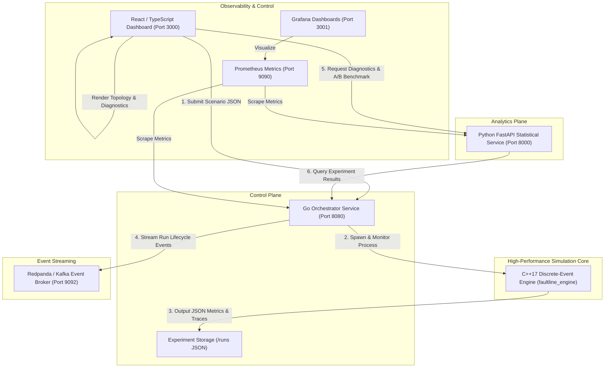

# Faultline

### Deterministic Distributed Systems Failure Simulation Engine

[](https://github.com/rahul-1909/faultline-simulator/actions/workflows/ci.yml)
[](https://isocpp.org/)
[](https://golang.org/)
[](https://python.org/)
[](https://react.dev/)
[](LICENSE)

---

## 1. Problem Statement

Modern microservice architectures at hyperscalers (such as Netflix, Amazon, Uber, and Google) are subject to complex failure modes:
- **Cascading Failures**: When one downstream dependency degrades, backpressure propagates upstream until edge gateways fail.
- **Retry Storms & Stampedes**: Naive fixed-interval or immediate retries amplify load on recovering services, turning transient hiccups into permanent outages.
- **Network Partitions & Split-Brain**: Network partitions drop or delay in-flight traffic, causing queue overflow and resource starvation.
- **Queue Saturation & Tail Latency Explosions**: High concurrency under degraded worker capacity pushes latency percentiles (p95, p99) into timeout thresholds.

Testing these pathologies in physical staging environments or via real-time emulation is slow, expensive, nondeterministic, and hard to reproduce.

**Faultline** is a high-performance, deterministic discrete-event simulation engine designed to model distributed systems under stress. By maintaining a virtual clock priority queue and seed-controlled pseudo-randomness, Faultline simulates complex multi-node network traffic, bounded queue dynamics, worker concurrency, and chaos injections in milliseconds—producing 100% reproducible results for resilience benchmarking and A/B mitigation comparison.

---

## 2. Architecture Overview

Faultline is composed of four decoupled subsystems coordinated across event streaming and observability layers:



---

## 3. Simulated Microservices Topology

Faultline models a multi-tier microservice architecture handling e-commerce order workflows:

```
[ Edge Clients ]
       │
       ▼ (Link L1: Latency 2ms, Loss 0.0)
┌──────────────┐
│  API Gateway │ (Workers: 8, Queue: 100, Base Latency: 5ms)
└──────┬───────┘
       │ (Link L2: Latency 4ms, Loss 0.0)
       ▼
┌──────────────┐
│ Order Service│ (Workers: 4, Queue: 50, Base Latency: 15ms)
└──────┬───────┘
       │ (Link L3: Latency 10ms, Subject to Chaos Partition)
       ▼
┌──────────────┐
│Payment Service│ (Workers: 2, Queue: 20, Base Latency: 45ms)  <-- Common Bottleneck
└──────┬───────┘
       │ (Link L4: Latency 3ms, Loss 0.0)
       ▼
┌──────────────┐
│ Inventory Svc│ (Workers: 4, Queue: 50, Base Latency: 10ms)
└──────────────┘
```

### Route Lifecycle Execution:
1. **Edge Dispatch**: Requests arrive according to a constant or Poisson-distributed rate.
2. **Worker Scheduling**: Upon arriving at a node, the request enters the bounded FIFO queue if workers are busy. If the queue is saturated, it is dropped immediately (`QUEUE_FULL`).
3. **Multi-Hop Sequential Processing**: A request completes execution at node `N` before transmitting across link `L` to node `N+1`. Network latency, queue waiting time, and service processing times are accumulated into end-to-end latency.
4. **Terminal States**: Every request reaches an unambiguous terminal state: `SUCCEEDED` only upon completion of the final service hop, or `FAILED` if dropped due to node crash (`NODE_DOWN`), queue saturation (`QUEUE_FULL`), network partition (`NETWORK_PARTITION`), packet loss (`PACKET_LOSS`), or retry exhaustion (`RETRY_EXHAUSTED`).

---

## 4. Discrete-Event Simulation Mechanics

Unlike real-time emulation (which must wait seconds or minutes of real wall-clock time), Faultline runs on a **Discrete-Event Simulation (DES)** model:
- **Priority Queue Scheduler**: Events are sorted strictly by `(timestamp, priority, sequence_id)`. Time advances instantaneously to the next scheduled event.
- **Epoch Generation Guarding**: Nodes track a monotonic generation epoch. When a service crashes and restarts, stale worker completion events from prior epochs are invalidated, preventing worker underflow or phantom completions.
- **Deterministic Seeded PRNG**: All jitter, retry delays, and probabilistic network packet losses use a standard 64-bit Mersenne Twister (`std::mt19937_64`) initialized with a user-specified seed. Running the same scenario with the same seed produces identical results down to the microsecond.

---

## 5. Failure Modes Catalog

| Fault Type | Scenario Trigger | Description & Engine Behavior |
| :--- | :--- | :--- |
| **Node Crash** | `"type": "CRASH_NODE"` | Transitions node to `OFFLINE`. Aborts processing workers and flushes queued requests as `NODE_DOWN`. |
| **Node Recovery** | `"type": "RECOVER_NODE"` | Transitions node to `ONLINE`. Advances generation epoch; ready to receive new requests. |
| **Network Partition** | `"type": "PARTITION_LINK"` | Flags network link as severed. In-transit and subsequent requests are dropped as `NETWORK_PARTITION`. |
| **Link Heal** | `"type": "HEAL_LINK"` | Restores link connectivity to normal latency and zero drop rate. |
| **Queue Overflow** | Implicit under load | When request arrival rate exceeds node service capacity `(workers / latency)`, queue saturates and drops with `QUEUE_FULL`. |
| **Retry Storm** | Workload + Fault | Bounded retries with exponential backoff and jitter re-inject requests into the gateway upon failure until `max_retries` is reached. |

### Example Fault Injection Syntax:
```json
{
  "events": [
    {
      "time_ms": 500.0,
      "type": "CRASH_NODE",
      "target": "payment-service"
    },
    {
      "time_ms": 1500.0,
      "type": "RECOVER_NODE",
      "target": "payment-service"
    },
    {
      "time_ms": 800.0,
      "type": "PARTITION_LINK",
      "target": "order->payment"
    },
    {
      "time_ms": 1800.0,
      "type": "HEAL_LINK",
      "target": "order->payment"
    }
  ]
}
```

---

## 6. Metrics & Statistical Methodology

- **Availability Rate (%)**:
  $$\text{Availability} = \left(\frac{\text{Successful Requests}}{\text{Total Injected Requests}}\right) \times 100$$
- **Latency Percentiles**: Latencies of all `SUCCEEDED` requests are recorded and sorted to compute exact $p_{50}$, $p_{90}$, $p_{95}$, and $p_{99}$ metrics.
- **System Reliability Index (SRI)**:
  $$\text{SRI} = 0.70 \times \text{Availability} + 0.30 \times \text{Latency Compliance Score}$$
  Where Latency Compliance scores $100$ when $p_{95} \le 50\text{ ms}$, decaying linearly for higher tail latency.
- **Bottleneck Identification**: The analytics engine ranks services by cumulative drop rate and peak queue saturation to pinpoint the primary failure bottleneck.
- **A/B Strategy Comparison**: Evaluates baseline resilience vs. mitigation strategies (e.g., Naive Retry vs Exponential Backoff + Jitter) under identical fault conditions and workloads.

---

## 7. Tech Stack

| Component | Language / Framework | Description |
| :--- | :--- | :--- |
| **Simulation Core** | C++17, STL | High-speed discrete-event simulator with microsecond precision |
| **Orchestrator** | Go 1.22, Net/HTTP | Concurrency controller, process supervisor, and Prometheus exporter |
| **Analytics Engine** | Python 3.12, FastAPI, NumPy | Statistical modeling, SRI calculation, and A/B benchmarking |
| **Dashboard** | React 18, TypeScript, Tailwind CSS, Lucide | Real-time interactive UI, topology visualization, and metrics charts |
| **Event Broker** | Redpanda (Kafka v23.3) | High-throughput distributed event streaming for simulation logs |
| **Observability** | Prometheus & Grafana | Time-series metrics scraping and dashboard visualization |
| **Containerization** | Docker, Docker Compose | Multi-stage production container builds |

---

## 8. Quickstart with Docker Compose

Deploy the entire Faultline suite with a single command:

```bash
cd deploy
docker compose up --build -d
```

### Accessing Endpoints:
- **Web Dashboard**: [http://localhost:3000](http://localhost:3000)
- **Go Orchestrator API**: [http://localhost:8080](http://localhost:8080)
- **FastAPI Analytics API**: [http://localhost:8000/docs](http://localhost:8000/docs)
- **Redpanda Console**: [http://localhost:8085](http://localhost:8085)
- **Prometheus Metrics**: [http://localhost:9090](http://localhost:9090)
- **Grafana Dashboards**: [http://localhost:3001](http://localhost:3001) *(login: `admin` / `faultline`)*

---

## 9. Manual Build & Execution

### Prerequisites:
- C++17 compiler (`g++` or `clang++`)
- Go 1.22+
- Python 3.10+
- Node.js 18+ and `npm`

### 1. Build C++ Simulation Engine
```bash
cd engine
g++ -std=c++17 -O3 -Wall -Wextra -pedantic -static -Iinclude src/main.cpp -o faultline_engine
```

### 2. Build & Run Go Orchestrator
```bash
cd orchestrator
go build -o faultline_orchestrator ./cmd/server
./faultline_orchestrator
```

### 3. Run Python Analytics Service
```bash
cd analysis
pip install -r requirements.txt
uvicorn app.main:app --host 0.0.0.0 --port 8000
```

### 4. Run React Dashboard
```bash
cd dashboard
npm install
npm run dev
```

---

## 10. Scenario Configuration Guide

Simulation scenarios are defined as JSON documents:

```json
{
  "name": "Payment Gateway Cascading Outage",
  "seed": 42,
  "duration_ms": 3000.0,
  "workload": {
    "arrival_rate_rps": 120.0,
    "distribution": "CONSTANT",
    "route": [
      "api-gateway",
      "order-service",
      "payment-service",
      "inventory-service"
    ]
  },
  "retry_policy": {
    "max_retries": 3,
    "backoff_ms": 25.0
  },
  "nodes": [
    {
      "id": "api-gateway",
      "workers": 8,
      "processing_time_ms": 5.0,
      "queue_capacity": 100
    },
    {
      "id": "order-service",
      "workers": 4,
      "processing_time_ms": 15.0,
      "queue_capacity": 50
    },
    {
      "id": "payment-service",
      "workers": 2,
      "processing_time_ms": 45.0,
      "queue_capacity": 20
    },
    {
      "id": "inventory-service",
      "workers": 4,
      "processing_time_ms": 10.0,
      "queue_capacity": 50
    }
  ],
  "links": [
    {
      "id": "gw->order",
      "source": "api-gateway",
      "target": "order-service",
      "latency_ms": 2.0,
      "loss_rate": 0.0
    },
    {
      "id": "order->payment",
      "source": "order-service",
      "target": "payment-service",
      "latency_ms": 5.0,
      "loss_rate": 0.0
    },
    {
      "id": "payment->inventory",
      "source": "payment-service",
      "target": "inventory-service",
      "latency_ms": 3.0,
      "loss_rate": 0.0
    }
  ],
  "events": [
    {
      "time_ms": 500.0,
      "type": "CRASH_NODE",
      "target": "payment-service"
    },
    {
      "time_ms": 1800.0,
      "type": "RECOVER_NODE",
      "target": "payment-service"
    }
  ]
}
```

---

## 11. Testing Guide

### 1. C++ Engine Regression Suite (11 Tests)
Validates virtual clock ordering, FIFO tie-breaking, queue overflow, link partitions, packet loss, multi-hop latency accumulation, request terminal states, crash generation epoch invalidation, crash queue eviction, scenario validation rules, and seed reproducibility:
```bash
g++ -std=c++17 -Wall -Wextra -pedantic -Iengine/include engine/tests/test_engine.cpp -o engine/tests/test_engine
./engine/tests/test_engine
```
*Expected Result:*
```
[PASS] Scheduler Event Ordering
[PASS] Equal Timestamp FIFO Tie-Breaking
[PASS] Node Queue Overflow
[PASS] Link Partition Packet Drop
[PASS] Link Packet Loss Rate
[PASS] Sequential Multi-Hop Latency Accumulation
[PASS] Request Terminal State Tracking
[PASS] Crash Event Invalidation & Recovery
[PASS] Crash Queue Eviction
[PASS] Scenario Validation Rules
[PASS] Deterministic Seed Reproducibility
All 11/11 tests PASSED successfully.
```

### 2. Go Orchestrator Unit Tests (7 Tests)
Validates experiment management, ID isolation, error handling, Prometheus metrics format, `/health` engine binary readiness check, and scenario JSON validation:
```bash
cd orchestrator
go test -v ./...
```
*Expected Result:*
```
=== RUN   TestHealthEndpoint
--- PASS: TestHealthEndpoint (0.00s)
=== RUN   TestMetricsEndpoint
--- PASS: TestMetricsEndpoint (0.00s)
=== RUN   TestExperimentsListEmpty
--- PASS: TestExperimentsListEmpty (0.00s)
=== RUN   TestCreateExperimentValidation
--- PASS: TestCreateExperimentValidation (0.00s)
=== RUN   TestGetNonExistentExperiment
--- PASS: TestGetNonExistentExperiment (0.00s)
=== RUN   TestCreateAndListExperiments
--- PASS: TestCreateAndListExperiments (0.00s)
=== RUN   TestCancelNonexistentExperiment
--- PASS: TestCancelNonexistentExperiment (0.00s)
PASS
```

### 3. Python Analytics Unit Tests (5 Tests)
Validates diagnostics calculation, SRI scores, bottleneck detection, empty results handling, and A/B comparison logic:
```bash
python -m unittest discover -s analysis/tests
```
*Expected Result:*
```
Ran 5 tests in 0.000s
OK
```

### 4. React Frontend Validation
Validates TypeScript static typing, component compilation, and bundle optimization:
```bash
cd dashboard
npm run build
```
*Expected Result:*
```
✓ built in ~10s with 0 errors
```

---

## 12. API Reference

### Go Orchestrator (`http://localhost:8080`)
- `GET /health` — Returns service health and verifies C++ engine binary execution readiness.
- `GET /metrics` — Prometheus metrics scraping endpoint.
- `GET /api/v1/experiments` — Lists historical and active simulation experiments.
- `POST /api/v1/experiments` — Submits a scenario for execution. Support `?wait=true` for synchronous execution.
- `GET /api/v1/experiments/{id}` — Retrieves experiment status, scenario, and output metrics.
- `DELETE /api/v1/experiments/{id}` — Cancels an in-flight experiment.

### Python Analytics Service (`http://localhost:8000`)
- `GET /health` — Health check endpoint.
- `POST /api/v1/analyze` — Analyzes raw simulation metrics, returning SRI and bottleneck diagnosis.
- `POST /api/v1/compare` — Performs A/B comparative evaluation of two simulation runs.
- `GET /api/v1/experiments/{id}/analysis` — Fetches experiment data directly from orchestrator and returns complete diagnostics.

---

## 13. License

Distributed under the MIT License. See `LICENSE` for more information.
